# Boom Gate Simulation - Complete System Flowchart

## 1. SYSTEM OVERVIEW

## 2. MAIN SIMULATION ENGINE FLOW

## 3. API HANDLER - ACTION ROUTING

## 4. BATCHED EXECUTION MODE (Detailed)

## 5. TWO-STEP EXECUTION MODE

## 6. SINGLE SIMULATION - DETAILED EVENT PROCESSING

## 7. DATA STRUCTURES

## 8. HEAP OPERATIONS

## 9. PERFORMANCE METRICS CALCULATION

```mermaid
flowchart LR
    subgraph "Accumulators"
        A1[Total Waiting Time]
        A2[Total Service Time]
        A3[Customers Who Waited]
        A4[Total Customers]
        A5[State Time Accumulator]
    end

    subgraph "Calculations"
        C1[Avg Wait = Total Wait / Total Customers]
        C2[Avg Wait for Waiters = Total Wait / Waiters]
        C3[Server Util = Total Service / Sim Time]
        C4[Prob Waiting = Waiters / Total Customers]
        C5[State % = Time in State / Sim Time × 100]
    end

    A1 --> C1
    A1 --> C2
    A2 --> C3
    A3 --> C2
    A3 --> C4
    A4 --> C1
    A4 --> C4
    A5 --> C5

    style A1 fill:#FFE0B2
    style C1 fill:#C5E1A5
```

## 10. MULTI-SEED AGGREGATION

## Key Components Summary

### 1. **Simulation Core**
- Memory-optimized event processing
- Min-heap for efficient departure management
- O(1) space complexity using accumulators

### 2. **Random Number Generation**
- Seeded LCG for reproducibility
- Exponential distribution via inverse transform
- Support for both exponential and deterministic service times

### 3. **Minimum Headway Constraint**
- Binary search to find adjusted arrival rate
- Ensures realistic vehicle spacing
- Tracks constrained arrivals

### 4. **State Tracking**
- Time-weighted queue length distribution
- Hourly maximum queue lengths
- Server utilization and waiting time metrics

### 5. **API Modes**
- **Legacy**: Single-call, simple
- **Two-Step**: Timing estimation + execution
- **Batched**: Progress tracking with rolling averages

### 6. **Multi-Seed Analysis**
- Statistical aggregation (avg, min, max)
- Confidence intervals via multiple replications
- Distribution aggregation for system states
